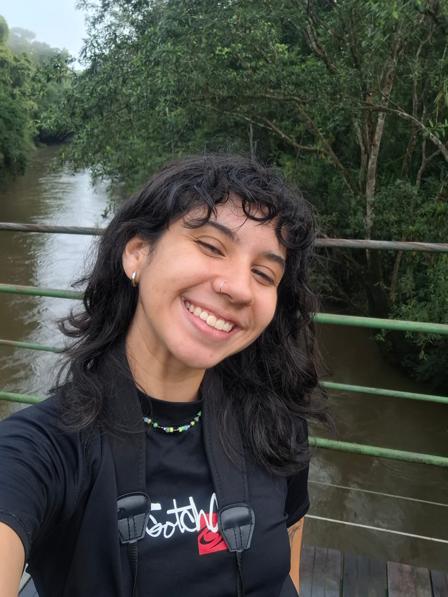
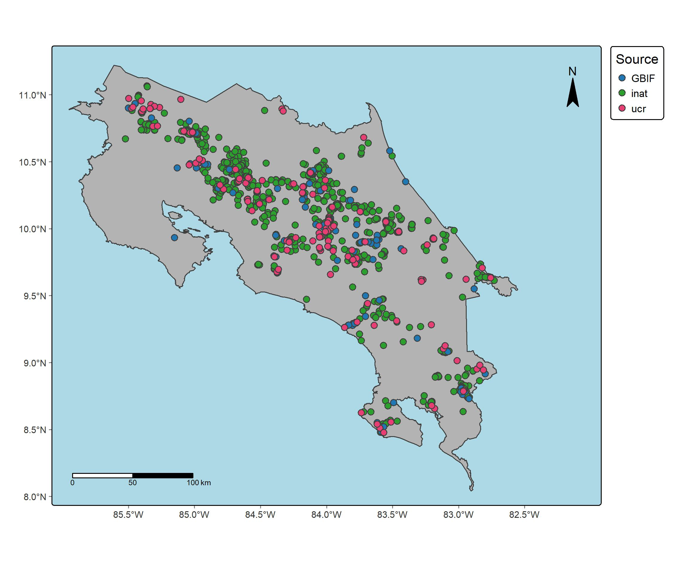
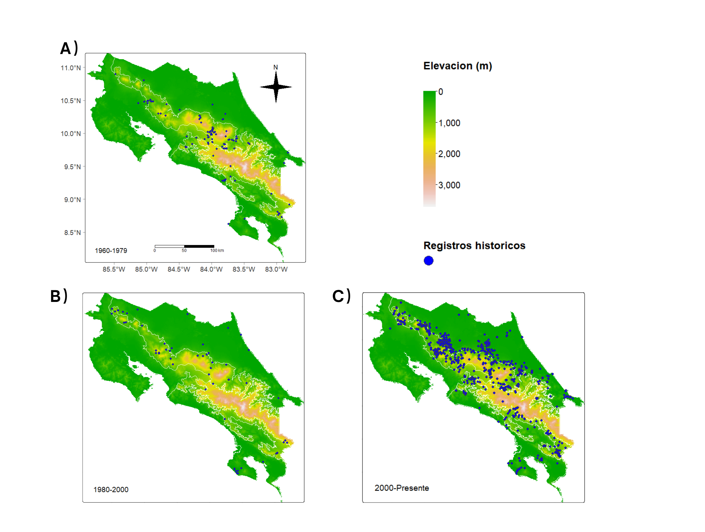
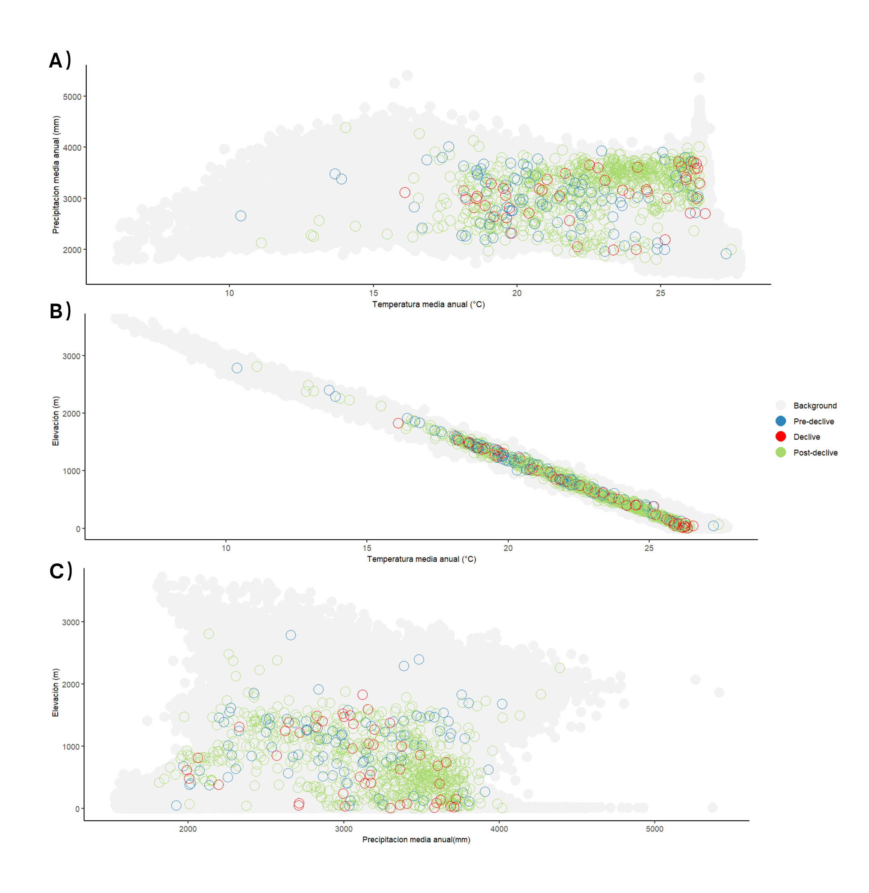

Tropical biology at the [School of Biological Science](https://www.biologia.una.ac.cr/) student with a strong interest in conservation, motivated to apply scientific knowledge for biodiversity protection and to promote community engagement in environmental initiatives.

## Experience
* Teacher Assistant at the [Organization for Tropical Studies](https://tropicalstudies.org/) (July 2025) – Managed logistics and organization. Supported tha professor with the course activities, fieldwork, and classes; assisted students with tropical biology concepts and methods. 

* Tropical Biology Laboratory Assistant , National University of Costa Rica (2024–Present) – Supported field data collection, creation of educational materials, and coordination of scientific events.
  
* Environmental Hydrology Laboratory Assistant, National University of Costa Rica (2024–Present) – Conducted water quality sampling, delivered educational workshops, and developed didactic resources.

* Entomology Laboratory Assistant, National University of Costa Rica (2024) – Collected and preserved Odonata specimens and maintained entomological collections.

* Phytochemistry Laboratory Assistant, National University of Costa Rica (2023–Present) – Analyzed biological samples using spectrophotometry and TLC, and prepared technical reports.

* Accreditation Commission Assistant, National University of Costa Rica (2023) – Managed data systems, administrative tasks, and communications with stakeholders.

## Projects

As part of my assistantship roles, I am involved in the following projects:

* Automated Acoustic Detection as a Tool for Biological Monitoring and Participatory Environmental Management: Case Study of the Bellbird in the Amistosa Biological Corridor.

* Biodiversity in Numbers: Knowledge Status and Conservation of Different Taxonomic Groups in Costa Rica.

* FOCAES-Extensión Universitaria: Establishment of the Citizen Water Observatory in Rancho Redondo for the management and conservation of the micro-watershed through participatory processes with local stakeholders.

* Validation of an Experimental-Computational Design for the Production of a Fungal Biosurfactant

## Education

Currently pursuing a bachelor's degree in Tropical Biology at the School of Biological Sciences, National University of Costa Rica.

## Languages
* Spanish
* English

## Hobbies
* Reading
* Hiking
* Painting

## Contact information
* [email](mailto:emisolano12@gmail.com)
* [GitHub](https://github.com/emisol02/emisol_masis-github.io.com)
* [Linkedin](https://www.linkedin.com/in/emily-solano-mas%C3%ADs-41a997349/)
* [Instagram](https://www.instagram.com/__emisol__/)

## Distribución de _Lithobates warszewitschii_ en Costa Rica
En esta figura busco representar la distribución de la especie a través de sus ocurrencias en diferentes sitios del país. Los datos se obtuvieron de tres fuentes: Global Biodiversity Information Facility (GBIF), iNaturalist (inat) y del museo de zoología de la Universidad de Costa Rica (ucr). 

## Distribución histórica de _Lithobates warszewitschii_ en Costa Rica 
En esta figura se pueden apreciar los cambios temporales en la distribución de registros históricos de _Lithobates warszewitschii_ en Costa Rica. Con estos mapas quería mostrar la ubicación de registros por periodo: (A) 1960–1979, (B) 1980–2000 y (C) 2000–presente. El gradiente de color representa la elevación (m), desde zonas bajas en verde hasta zonas altas en rosado. Los puntos azules indican los registros históricos georreferenciados de la especie.

!

## Distribución ambiental de los registros de _Lithobates warszewitschii_ en Costa Rica

Quice mostrar los registros de _Lithobates warszewitschii_ en Costa Rica a lo largo de diferentes periodos históricos. Los puntos representan los registros de presencia de la especie en relación con variables climáticas y altitudinales: (A) precipitación media anual frente a temperatura media anual, (B) elevación frente a temperatura media anual y (C) elevación frente a precipitación media anual. Los colores indican las fases temporales del historial poblacional: azul (predeclive), rojo (durante el declive) y verde (postdeclive). Los puntos grises corresponden al fondo ambiental (background) disponible en el país.

!

